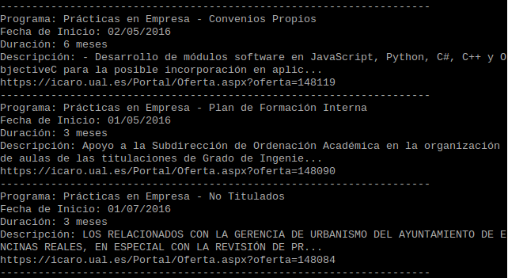

# Parser ICARO

Obtiene las ofertas de prácticas/empleo del portal de las siguientes universidades:

1. Universidad Autónoma de Madrid
2. Universidad de Almería
3. Universidad de Cádiz
4. Universidad de Córdoba
5. Universidad de Granada
6. Universidad de Huelva
7. Universidad de Jaén
8. Universidad de Málaga
9. Universidad de Sevilla
10. Universidad Pablo de Olavide
11. Universidad Politécnica de Cartagena

Existen tres programas distintos en dicho portal:

* Prácticas en Empresa
* Agencia de Colocación
* Formación para el Empleo

Vista previa:



## Requisitos

* Python 3
* Módulo BeautifulSoup, por si ayuda al que no lo tenga: 
`sudo apt-get install python3-bs4`

## Solicitud alternativa por identificador

Sustituir el array *slug* y la variable *url*
```
slug = ["23", "03", "05", "06", "08", "49", "50", "11", "17", "58", "64"]
url = 'https://icaro.ual.es/Default.aspx?universidad='+opt
```